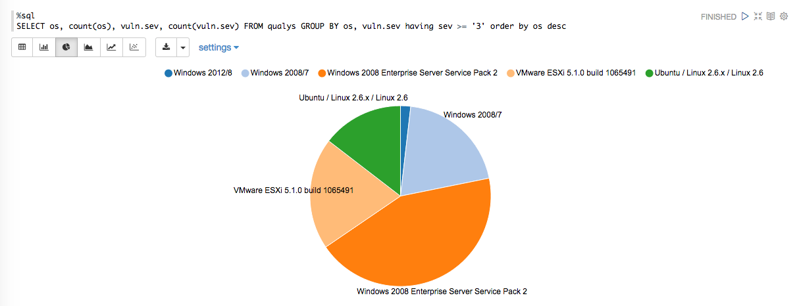
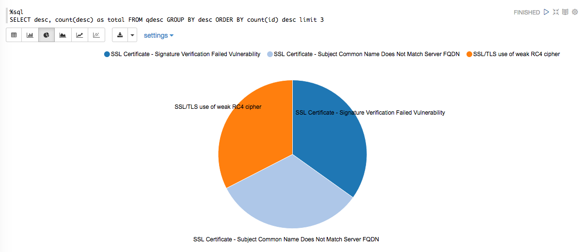
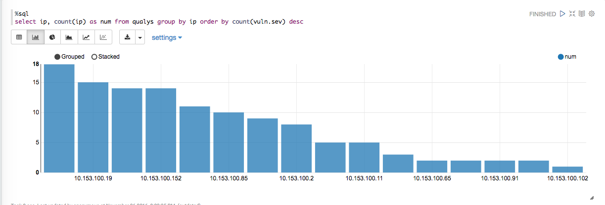
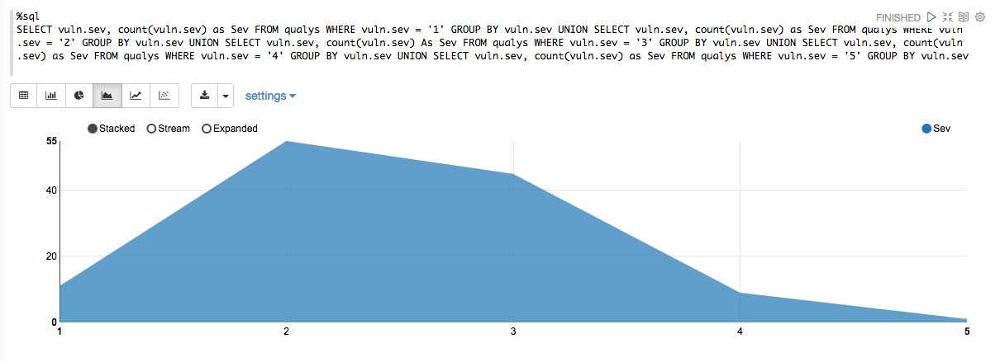
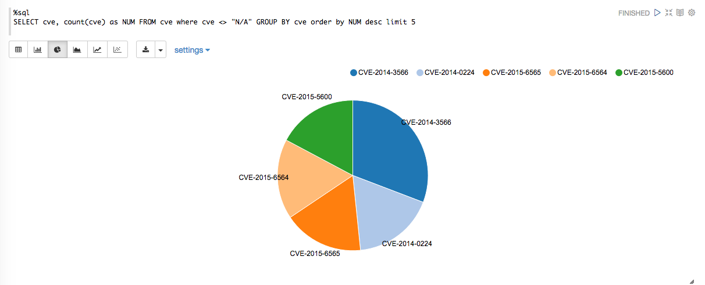

How to leverage Apache Zeppelin with Apache Spark for interactive visualization of vulnerability scan data.
================


BeyondTrust - Retina Vulnerability Scanner

Qualys - Vulnerability Scanner

======

Getting Started
=======

For this example I built Apache Zeppelin from source on Ubuntu Server 14.04.5 LTS with the following profiles Spark 2.0 (Apache Spark 2.0.1), Scala 2.11, and Hadoop 2.6.

* [Apache Zeppelin] (https://github.com/apache/zeppelin)

Next, we'll convert the vulnerabilty scan data (Qualys/Retina) from XML to JSON.  Depending on the size of your scan data you may need to set the minimum (-Xms) and maximum (-Xmx) memory allocation for the JVM when running **SecOps.jar**.  Also provided are perl scripts that will cut the scan data down to a manageable size.

 
```
java -jar SecOps.jar qj <Path to Scan File>

The output will result in a single JSON object for each Asset Scanned.

{"ip":"100.153.22.212","host":"tx2winweb01”,”os”:”Windows Server 2008”,”vuln”: [{"id":"70000","desc":"NetBIOS Name Accessible","sev":"2"},{"id":"38170","desc":"SSL Certificate - Subject Common Name Does Not Match Server FQDN","sev":"2"},{"id":"38173","desc":"SSL Certificate - Signature Verification Failed Vulnerability","sev":"2"},{"id":"38601","desc":"SSL/TLS use of weak RC4 cipher","sev":"1","cve":["CVE-2013-2566"]},{"id":"90882","desc":"Windows Remote Desktop Protocol Weak Encryption Method Allowed","sev":"3"}]}

```

=========

Load Our Data

=========

```
import org.apache.spark.sql.catalyst.encoders.ExpressionEncoder
import org.apache.spark.sql.Encoder
import org.apache.spark.sql.Row
import org.apache.spark.sql.types._
import spark.implicits._

/** Scan Data */

val qf = spark.read.json("/tmp/scandata.json")
val sev = qf.withColumn(“vuln”, explode($”vuln”))
sev.distinct().createOrReplaceTempView(“qualys”)


```

Number of severities by OS
======




Top vulnerabilities
======

```
import org.apache.spark.sql.functions.{udf, explode}

val zip = udf((xs: Seq[String], ys: Seq[String]) => xs.zip(ys))

qf.withColumn("cols", explode(zip($"vuln.id", $"vuln.desc"))).select(
   $"cols._1".alias("id"), $"cols._2".alias("desc")).createOrReplaceTempView("qdesc")

```




Servers with the most vulnerabilities
======




Number of severities by security level
======

 


Top CVEs by count
======

```
import org.apache.spark.sql.functions.{udf, explode}

val l = qf.withColumn("vars", explode($"vuln.cve")).select(
   $"vars".alias("cve"))
l.withColumn("first", explode($"cve")).select($"first".alias("cve")).createOrReplaceTempView("cve")

```

 
